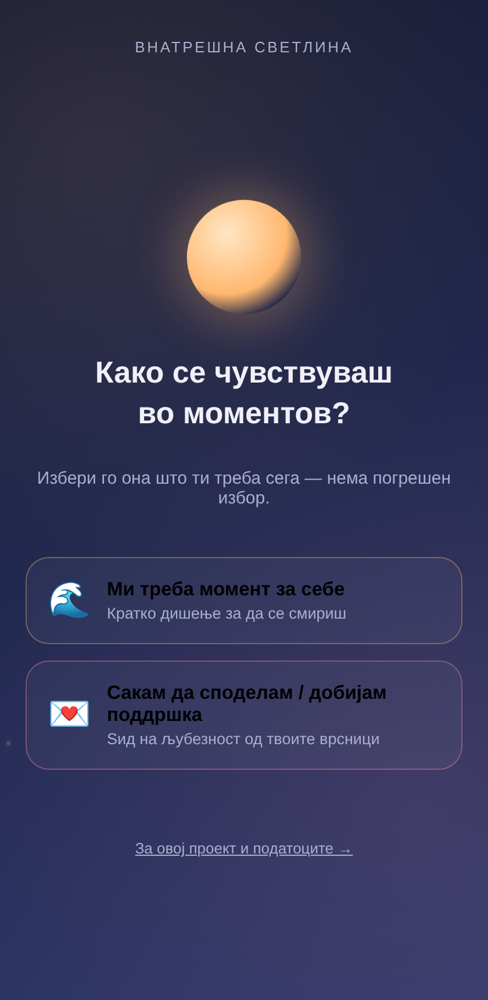
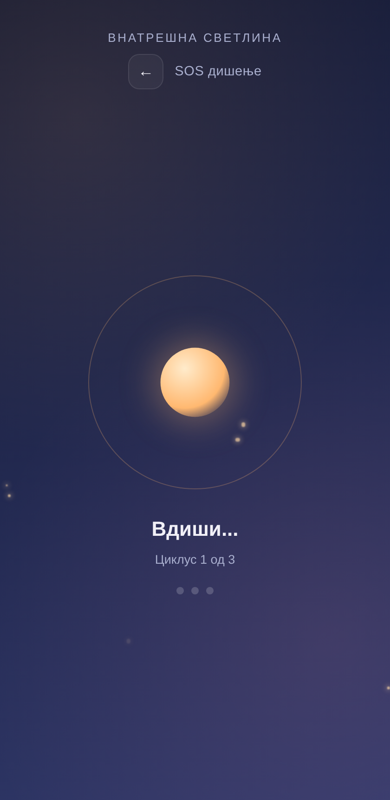
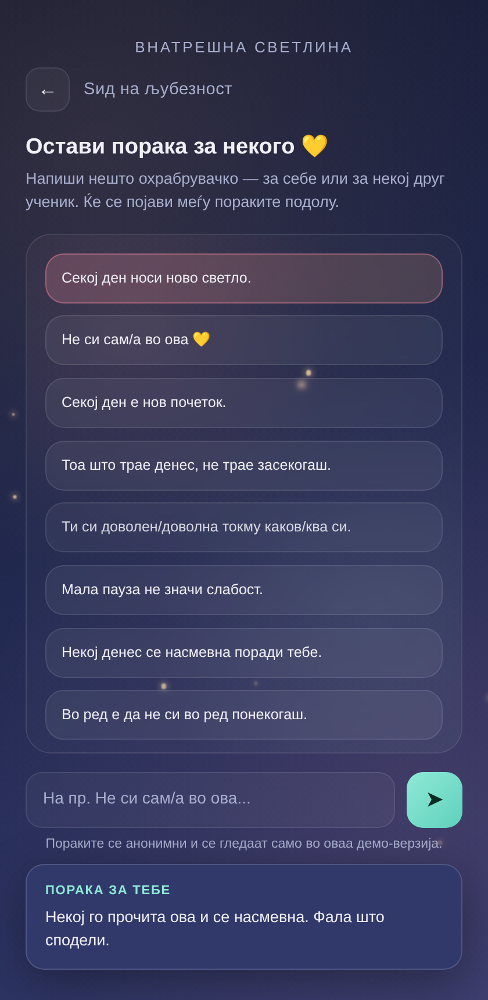
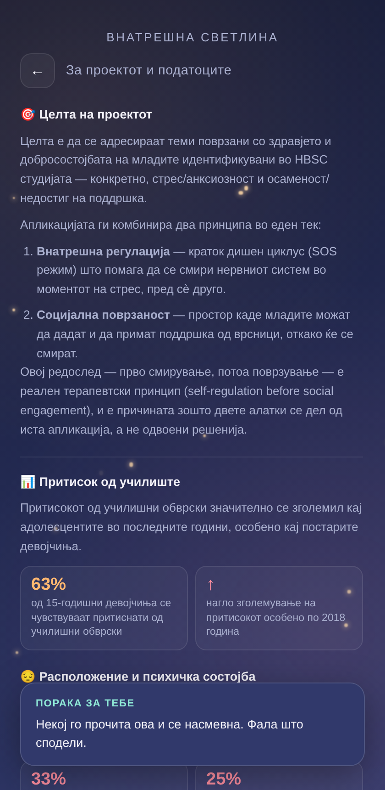

# 🌙 Внатрешна светлина

Интерактивна веб-апликација за адолесцентно здравје и добросостојба, развиена како одговор на наодите од **HBSC студијата** (Health Behaviour in School-aged Children). Комбинира алатка за смирување и простор за меѓусебна поддршка во едно единствено, едноставно искуство.

---

## 📱 Изглед

| Почетен екран | SOS дишење |
|---|---|
|  |  |

| Ѕид на љубезност | За проектот и податоците |
|---|---|
|  |  |

---

## 💡 Идејата

Апликацијата нуди **два поврзани режими**, достапни од еден почетен екран според прашањето *„Како се чувствуваш во моментов?"*:

- 🌊 **SOS дишење** — воден циклус на дишење по 4-7-8 техниката (вдиши 4с → задржи 7с → издиши 8с, 3 повторувања), со анимиран круг што го следи ритамот. Помага за брзо смирување на нервниот систем во момент на стрес.
- 💌 **Ѕид на љубезност** — простор каде корисникот може да остави кратка порака на охрабрување (за себе или за некој друг), да ја види меѓу пораките на другите, и да добие случајна порака на поддршка назад.

Редоследот не е случаен: прво **внатрешна регулација**, потоа **социјална поврзаност** — реален терапевтски принцип (self-regulation before social engagement).

Апликацијата вклучува и посветен **инфо-екран** со целта на проектот и клучни податоци од HBSC извештајот (2021/2022) за училишен притисок, психичка состојба и осаменост кај адолесцентите, вклучувајќи и графички приказ на статистиките.

---

## 🛠️ Технологии

- **HTML / CSS / JavaScript**


## 📁 Структура на проектот

```
vnatresna-svetlina/
├── index.html          # целата апликација (HTML + CSS + JS)
├── screenshots/         # скриншотови користени во README
│   ├── 01-home.png
│   ├── 02-breathing.png
│   ├── 03-kindness-wall.png
│   └── 04-info.png
└── README.md
```

## 📊 Извор на податоците

Здравствените статистики прикажани во апликацијата се земени од:

> Cosma A, Abdrakhmanova S, Taut D, Schrijvers K, Catunda C, Schnohr C. *A focus on adolescent mental health and wellbeing in Europe, central Asia and Canada. Health Behaviour in School-aged Children (HBSC) international report from the 2021/2022 survey.* Copenhagen: WHO Regional Office for Europe; 2023.

Податоците претставуваат меѓународни просеци од земјите опфатени со студијата, не се специфични само за Северна Македонија.

## 💛 Забелешка

Оваа апликација е едукативен/демо прототип и **не претставува замена за професионална психолошка помош**. Ако некој се соочува со потешка криза, треба да побара поддршка од доверливо возрасно лице, стручно лице или релевантна линија за поддршка.

---


